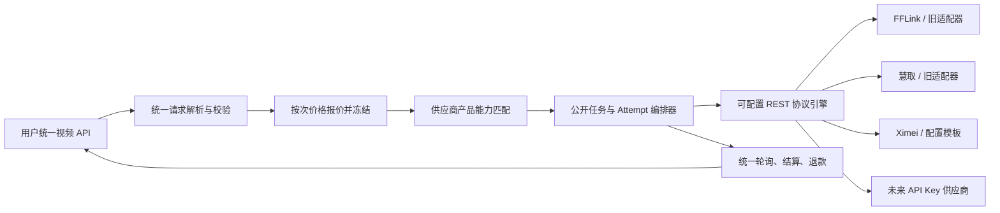

# Seedance 统一供应商协议引擎与按次计费开发方案

> 状态：长期架构参考，不属于当前迭代实施范围
> 日期：2026-08-06
> 范围：仅支持 `apikey` 类型的视频上游账号

当前迭代已收敛为“Seedance 按次计费 + Ximei 专用官方 API 适配”。实施方案见 `SEEDANCE_XIMEI_PER_REQUEST_BILLING_PLAN_CN.md`。

## 1. 一页结论

本次改动不是“再兼容一个 Ximei 供应商”，而是把当前 Seedance 的供应商硬编码转发，升级成一套可配置的 API Key 视频供应商接入引擎。

最终应达到以下结果：

1. 用户始终调用 TKCreazy 的统一视频 API，不感知供应商协议。
2. 管理员可以配置标准 REST + API Key 视频上游，无需为每家供应商修改 Go 代码或重新部署。
3. `model`、`provider_route`、`engine`、`channel` 等上游字段统一抽象为“供应商模型产品选择器”。
4. 每个供应商模型产品独立声明模型家族、清晰度、秒数、素材能力、上游成本和路由优先级。
5. 调度器根据本次请求动态筛选完整兼容的供应商产品，而不是只根据模型名称筛账号。
6. fallback 可以跨供应商进行，但用户看到的 `job_id`、公开模型和最终价格始终不变。
7. Seedance 用户计费改为“公开模型 + 清晰度”的单次价格，不再乘视频秒数。
8. 现有 FFLink、慧取账号无需重做配置，旧任务和旧 fallback 在迁移期继续可查询、结算和退款。

## 2. 难度评估

整体难度：**中高，约 7.5/10**。

单独写一个 Ximei 适配器并不难，但那仍然是一次性兼容。真正的统一方案难点在于：

- 安全、可校验的请求与响应映射规则，而不是任意脚本。
- 协议模板版本化，避免管理员改配置后破坏正在运行的任务。
- 将当前“一个主任务 + 一个固定 fallback”升级成“一个公开任务 + N 个内部 attempt”。
- fallback、未知接收状态、幂等、结算和退款之间的一致性。
- 在不改变 Grok、LTX、HappyHorse 计费语义的情况下，只把 Seedance 改为按次计费。
- 保留现有 FFLink、慧取账号和在途任务的兼容性。

生产级完整方案预计约 **15-25 个有效开发日**，真实供应商异步视频验证还需要额外的自然等待时间。若只做 Ximei 专用分支可更快，但不符合本次目标。

## 3. 已确认的产品决策

### 3.1 对外 API 统一

用户继续调用：

```text
POST   /v1/videos/generations
POST   /v1/videos/uploads
GET    /v1/videos/jobs
GET    /v1/videos/jobs/{job_id}
GET    /v1/videos/jobs/{job_id}/content
DELETE /v1/videos/jobs/{job_id}
```

公开请求只包含模型、提示词、秒数、清晰度、比例和参考素材，不包含：

- 供应商名称
- 上游 Base URL
- `provider_route`
- 上游模型产品名
- 上游任务 ID
- 上游 API Key

### 3.2 账号范围

新引擎只处理：

```text
platform = seedance
account_type = apikey
```

`apikey` 只表示凭证类型，不表示上游兼容 OpenAI。上游仍按其官方协议调用。

不支持 OAuth、Cookie、Session、网页登录、验证码和自动刷新凭证。

### 3.3 供应商模型产品，而不是普通路由

统一名称使用 `ProviderOffering`（供应商模型产品）。

| 供应商 | 上游产品选择方式 | 示例 |
|---|---|---|
| FFLink | JSON `model` | `seedance-2.0` |
| 慧取 | JSON/表单 `model` | `sd2-pro-933-480-5s` |
| Ximei | JSON `provider_route`，并固定 `model=video` | `kele_pool` |
| 未来供应商 | 后台配置 | `engine`、`model_id`、`channel` 等 |

`provider_route` 在 Ximei 中承担的语义，与其他厂商的模型名或质量 SKU 相同，不应被当成普通网络线路。

### 3.4 Seedance 按次计费

本方案将用户的计费键定义为：

```text
公开模型 + 清晰度 = 单次价格
```

例如：

| 公开模型 | 清晰度 | 单次价格 |
|---|---|---:|
| `seedance-2.0` | 480p | 管理员配置 |
| `seedance-2.0` | 720p | 管理员配置 |
| `seedance-2.0-fast` | 480p | 管理员配置 |
| `seedance-2.0-fast` | 720p | 管理员配置 |
| `seedance-2.5` | 720p | 管理员配置 |

秒数继续参与能力校验和供应商筛选，但不乘入用户价格。

## 4. 当前实现与缺口

当前代码已经存在部分可复用能力：

- `VideoModelPrices` 已支持“模型 -> 清晰度 -> 价格”矩阵。
- 用户专属视频价格覆盖已经存在。
- Seedance 任务已经保存公开任务与上游任务的绑定关系。
- FFLink 失败后转慧取的 fallback、最终结算和退款幂等已经存在。
- 平台已有统一上传入口和统一任务查询入口。

主要缺口：

1. `backend/internal/service/seedance_huiqu.go` 只识别 FFLink、慧取两个供应商。
2. `backend/internal/service/seedance.go` 通过供应商分支手写请求和响应转换。
3. `backend/internal/service/fflink_video_models.go` 将模型能力硬编码在代码中。
4. `fflink_video_job_bindings` 只适合一个主任务和一个特定 fallback，无法自然表达 N 次供应商尝试。
5. `BillingService.CalculateVideoCost` 当前按“单价 × 秒数 × 数量”计算。
6. 管理后台只能选择内置供应商、Base URL、Key 和模型映射，不能配置协议和供应商产品能力。

## 5. 目标架构



核心业务层不允许出现 `if provider == ximei`。供应商差异只能存在于协议模板、供应商产品配置或极特殊协议插件中。

## 6. 核心领域对象

### 6.1 CanonicalVideoRequest

统一请求对象：

```text
public_model
prompt
duration_seconds
resolution
aspect_ratio
generate_audio
prompt_enhance
image_references[]
video_references[]
audio_references[]
```

视频和音频引用增加可选 `duration_seconds`：

- 平台上传文件：上传时自动探测并保存时长。
- 外部 URL：优先使用用户提供的时长；未提供时由平台探测。
- 无法探测时返回明确错误，不允许伪造时长或静默丢字段。

### 6.2 PublicVideoProduct

公开视频产品目录定义用户能够看到和购买的稳定产品契约：

- 公开模型 ID 与展示名称
- 模型家族和质量定位
- 默认清晰度、秒数和比例
- 对外允许的清晰度、秒数、比例和素材能力
- 是否支持声音、首尾帧和提示词增强
- 是否启用

PublicVideoProduct 不包含供应商账号、上游字段或上游产品名称。

质量、审核规则或输出能力对用户可感知时，应建立不同的公开产品；只有公开能力和质量等价的 ProviderOffering，才能映射到同一个 PublicVideoProduct 并互相 fallback。

### 6.3 ProtocolProfile

描述“如何调用一个标准 API Key REST 上游”：

- 鉴权方式
- Base URL 与路径模板
- 创建任务请求格式
- 查询任务请求格式
- 取消任务请求格式
- JSON 或 multipart 编码
- 请求字段映射
- 任务 ID、状态、结果和错误提取规则
- 状态枚举映射
- 超时、轮询间隔和响应大小限制
- 模板版本、状态和校验摘要

协议模板必须支持 `draft -> tested -> published -> retired` 生命周期。

运行中的 attempt 必须绑定创建时的模板版本。发布新版本不能改变旧任务的查询和结果解析方式。

### 6.4 ProviderAccount

继续复用现有 `accounts`，只保存连接和凭证：

- `account_type=apikey`
- Base URL
- API Key（加密保存）
- 代理
- 并发限制
- 超时
- 启用状态
- 绑定的 ProtocolProfile

同一个账号可以拥有多个 ProviderOffering，并共享同一 API Key 和并发额度。

### 6.5 ProviderOffering

描述一个供应商实际出售的模型/质量产品：

- 所属账号
- 协议模板
- 对外公开模型映射
- 上游产品选择器字段和值
- 固定请求字段
- 支持的清晰度
- 秒数模式、范围或枚举
- 比例列表
- 图片、视频、音频及总素材上限
- 音频和视频累计时长上限
- 是否支持生成声音、首帧、尾帧和提示词增强
- 上游单次成本
- 调度优先级、权重和 fallback 分组
- 健康状态

运行时真正的调度单位是：

```text
VideoRouteTarget = ProviderAccount + ProviderOffering + ProtocolProfileVersion
```

### 6.6 VideoJob 与 VideoJobAttempt

`VideoJob` 是用户看到的稳定任务：

- 平台生成的公开 `job_id`
- 用户、API Key 和分组
- 公开模型、清晰度、秒数
- 请求快照与持久化素材引用
- 创建时冻结的价格报价
- 聚合任务状态
- 最终结果或最终错误

`VideoJobAttempt` 是内部每一次供应商尝试：

- attempt 序号
- 账号与 ProviderOffering
- ProtocolProfile 版本
- 上游任务 ID
- attempt 幂等键
- 状态与错误分类
- 创建、轮询和完成时间
- 上游实际成本

用户查询永远只查询 VideoJob，不直接查询上游任务 ID。

## 7. 数据库方案

建议新增：

### 7.1 `video_model_products`

```text
id
public_model
display_name
model_family
capabilities_json
defaults_json
enabled
created_at
updated_at
```

### 7.2 `video_protocol_profiles`

```text
id
name
version
status
config_json
config_checksum
created_by
created_at
updated_at
published_at
```

### 7.3 `video_provider_offerings`

```text
id
account_id
protocol_profile_id
name
public_models
selector_json
capabilities_json
upstream_cost_json
priority
weight
fallback_group
enabled
created_at
updated_at
```

### 7.4 `video_jobs`

```text
id
public_job_id
user_id
api_key_id
group_id
requested_model
resolution
duration_seconds
request_snapshot
billing_quote
status
result_json
error_json
created_at
updated_at
completed_at
```

### 7.5 `video_job_attempts`

```text
id
video_job_id
attempt_no
account_id
offering_id
protocol_profile_id
protocol_version
upstream_job_id
idempotency_key
status
error_class
error_json
upstream_cost_json
created_at
updated_at
completed_at
```

旧 `fflink_video_job_bindings` 不做破坏性改名：

1. 新任务切换到新表。
2. 查询和 settlement worker 在迁移期同时读取新旧任务。
3. 旧任务保留到超过现有任务生命周期和结算窗口。
4. 确认无在途任务后再单独退役旧表。

## 8. 安全映射 DSL

后台配置不能执行 JavaScript、Shell、模板注入或任意代码。映射引擎只提供受限、确定性的操作：

- `source`：读取统一请求字段
- `constant`：写固定值
- `rename`：字段重命名
- `cast`：字符串、数字、布尔转换
- `enum_map`：枚举映射
- `map_array`：数组转数组或对象数组
- `omit_empty`：空值省略
- `condition`：有限条件选择
- `coalesce`：多个响应路径依次取值
- `path_template`：只允许已声明变量的 URL 路径模板
- JSON Pointer 或标准 JSONPath 响应提取

示例：Ximei 使用同一通用引擎配置，而不是专用代码。

```json
{
  "kind": "rest_apikey",
  "mode": "async",
  "auth": { "type": "bearer", "secret": "account.api_key" },
  "create": {
    "method": "POST",
    "path": "/api/v3/contents/generations/tasks",
    "content_type": "application/json",
    "body": {
      "model": { "constant": "video" },
      "provider_route": { "source": "offering.selector" },
      "prompt": { "source": "request.prompt" },
      "duration": { "source": "request.duration_seconds" },
      "aspect_ratio": { "source": "request.aspect_ratio" },
      "generate_audio": { "source": "request.generate_audio" },
      "image_urls": { "map_array": "request.images", "value": "item.url" },
      "video_urls": {
        "map_array": "request.videos",
        "object": { "url": "item.url", "durationSeconds": "item.duration_seconds" }
      },
      "audio_urls": {
        "map_array": "request.audios",
        "object": { "url": "item.url", "durationSeconds": "item.duration_seconds" }
      }
    }
  },
  "query": {
    "method": "GET",
    "path": "/api/v3/contents/generations/tasks/{upstream_job_id}",
    "status_path": "$.status",
    "status_map": {
      "queued": "queued",
      "running": "running",
      "succeeded": "completed",
      "failed": "failed"
    },
    "result_url_path": "$.content.video_url",
    "error_code_path": "$.error.code",
    "error_message_path": "$.error.message"
  }
}
```

未来供应商如果使用 `seconds` 或 `engine`，管理员只改目标字段映射。

## 9. 能力匹配与路由

请求级选择流程：

1. 解析并标准化统一请求。
2. 根据公开模型找到所有 ProviderOffering。
3. 逐个校验清晰度、秒数、比例、素材数量和素材累计时长。
4. 排除账号不可调度、并发耗尽、健康检查失败或协议未发布的产品。
5. 按显式路由、优先级、健康度、权重和成本策略排序。
6. 创建公开 VideoJob 和第一次 attempt。
7. 技术性失败时创建下一次 attempt。
8. 成功或所有兼容产品耗尽后进入公开终态。

任务列表直接查询本地 VideoJob，不应为列表中的每个任务访问上游，也不应在列表接口中触发 fallback。

不支持的字段必须导致产品被排除或返回明确错误，不能静默删除。

多个供应商产品只有在公开模型语义、清晰度、秒数和素材能力满足本次请求时才能互相 fallback。SD2.5 不得隐式作为 SD2 的 fallback。

## 10. fallback、幂等与任务一致性

### 10.1 稳定公开任务 ID

平台必须在第一次调用上游前生成 `public_job_id`。后续无论发生多少次 fallback，用户都使用这个 ID。

### 10.2 Attempt 幂等

每次 attempt 使用独立且稳定的幂等键：

```text
{public_job_id}:{attempt_no}:{offering_id}
```

同一次 attempt 的网络重试必须复用相同幂等键；切换供应商产品时使用新的 attempt 键。

### 10.3 未知接收状态

如果请求可能已到达上游，但未能获取任务 ID，不能立即 fallback，否则可能重复生成并产生双重上游成本。

此时任务进入 `acceptance_unknown`，由 reconciliation worker 使用幂等键恢复或确认失败后再继续。

### 10.4 可 fallback 错误

默认只对技术类错误 fallback：

- 资源不足
- 服务不可用
- 网络错误
- 明确的上游任务技术失败
- 可重试超时

审核、肖像、版权和参数错误不用于绕过审核的 fallback。

## 11. Seedance 按次计费设计

当前 `VideoModelPrices` 数据结构可以继续使用，但其 Seedance 语义从“每秒单价”改为“每次单价”。

### 11.1 新计费公式

```text
base_price = price[requested_public_model][resolution]
total_cost = base_price * video_count
actual_cost = total_cost * effective_user_multiplier
```

`duration_seconds` 不参与费用计算。

### 11.2 保持其他平台不变

- Seedance：按次。
- Grok：继续按秒，保持现有逻辑。
- LTX、HappyHorse：本次不改变其计费语义。

应新增明确的 `video_billing_unit`，至少支持：

```text
per_second
per_request
```

不要通过平台名称或价格字段是否为空来猜计费单位。

### 11.3 报价快照

创建 VideoJob 时保存：

- 公开模型
- 清晰度
- 单次基础价
- 用户专属覆盖或倍率
- 最终冻结金额
- 价格来源
- 计费单位

任务成功时按报价快照结算，不能重新读取最新价格。管理员在任务运行期间改价不影响已创建任务。

### 11.4 fallback 计费

- 用户只冻结一次。
- 创建新 attempt 不重复冻结或扣费。
- 任一 attempt 成功只结算一次。
- 所有兼容 attempt 最终失败只退款一次。
- fallback 到成本更高或更低的上游产品，不改变用户报价。
- 上游成本独立记录在 attempt，用于毛利分析。

### 11.5 价格迁移

现有 Seedance 价格数值是“每秒价”，不能直接静默解释成“每次价”。建议：

1. 增加 `video_billing_unit`，现有分组迁移为 `per_second`，防止部署后价格突变。
2. 管理员填写新的模型 × 清晰度单次价格。
3. 后台预览 5/10/15 秒请求在新模式下均为同一价格。
4. 原子切换分组到 `per_request`。
5. 全部分组迁移完成后，再决定是否退役 Seedance 旧模式。

账号无需重配，但价格属于业务配置，必须审核后切换，不能自动猜测。

## 12. 管理后台方案

### 12.1 协议模板管理

字段：

- 模板名称与版本
- REST 模式：同步/异步
- 鉴权：Bearer/Header/Query API Key
- 创建、查询、取消路径
- JSON/multipart
- 请求映射
- 响应提取和状态映射
- 超时与轮询参数
- 草稿、测试、发布和退役

### 12.2 API Key 账号表单

字段：

- 平台：Seedance
- 账号类型：API Key（固定）
- 协议模板
- Base URL
- API Key
- 代理
- 并发
- 超时
- 状态

### 12.3 供应商模型产品编辑器

字段：

- 内部名称
- 对外公开模型
- 上游产品选择器字段和值
- 固定上游字段
- 清晰度
- 秒数模式与范围
- 比例
- 图片、视频、音频和总素材限制
- 音视频累计时长
- 首尾帧、生成声音和增强能力
- 上游单次成本
- 优先级、权重、fallback 分组
- 启用状态

### 12.4 Seedance 单次价格矩阵

后台展示“模型 × 清晰度 × 单次价格”，明确标注 `$ / 次`，不再显示 `$ / 秒`。

继续支持：

- 分组基础单次价格
- 用户专属单次价格覆盖
- 用户或分组倍率
- 最终价格预览

### 12.5 配置测试与发布

发布协议或产品前必须依次通过：

1. JSON Schema 和映射静态校验。
2. Base URL 与认证测试。
3. 创建请求预览，敏感字段脱敏。
4. 实际创建测试任务。
5. 轮询到终态并验证结果提取。
6. 管理员确认后发布。

## 13. 安全与审计

- API Key 使用现有加密机制保存，响应和日志只显示脱敏值。
- 协议模板只能引用账号顶层的敏感凭证字段；密钥不得嵌套保存到普通映射 JSON 中，避免绕过现有加密和脱敏机制。
- Base URL 继续使用上游地址安全校验，防止 SSRF。
- 协议模板只能访问账号声明的 Base URL，不能把密钥发送到其他域名。
- 映射 DSL 不提供任意代码、网络请求、文件读取或环境变量访问。
- 所有模板发布、产品修改、价格切换都写管理员审计日志。
- 日志记录公开任务、attempt、账号、产品和模板版本，但不向用户暴露供应商内部信息。
- 任务请求快照只保存持久化素材引用，不长期保存即将过期的签名 URL。

## 14. 开发阶段与验收

### 阶段 0：方案冻结与契约测试基线（1-2 天）

任务：

- 确认公开 API 不变。
- 确认“不同模型 × 不同清晰度 × 按次价格”。
- 确认 ProviderOffering 命名和范围。
- 为现有 FFLink、慧取、fallback、计费建立回归基线。

验收：现有真实请求和关键测试结果形成基线记录。

### 阶段 1：Seedance 按次计费双模式（2-3 天）

任务：

- 增加明确计费单位。
- 实现 Seedance 单次计费函数。
- 保持 Grok 等其他平台按秒逻辑不变。
- 修改分组和用户专属价格表单文案与预览。
- 增加安全迁移和原子切换。

验收：同模型同清晰度的 5/10/15 秒价格完全相同；fallback 仍只结算一次。

### 阶段 2：通用领域模型与数据库（3-4 天）

任务：

- 建立 ProtocolProfile、ProviderOffering、VideoJob、VideoJobAttempt。
- 新增仓储接口和迁移。
- 实现模板和产品版本快照。
- 新旧任务查询与 settlement 并行兼容。

验收：纯内存仓储即可跑通任务与多 attempt 状态机。

### 阶段 3：安全协议映射引擎（4-6 天）

任务：

- 支持 API Key Bearer/Header/Query 鉴权。
- 支持 JSON、multipart、同步、异步。
- 支持有限映射操作和结构化响应提取。
- 支持模板静态校验、请求预览和版本发布。
- 建立超时、响应大小、URL 和媒体安全边界。

验收：两个字段结构完全不同的模拟供应商仅靠配置即可创建、查询并取得结果。

### 阶段 4：能力调度、N 次 fallback 与结算（4-6 天）

任务：

- 请求级产品能力过滤。
- 公开任务与 attempt 编排。
- 未知接收状态 reconciliation。
- N 次 fallback、取消、轮询、结果代理。
- 单次冻结、单次结算、最终失败单次退款。

验收：跨三个模拟供应商 fallback 后，公开 job ID、模型、报价不变且没有重复扣款。

### 阶段 5：管理员配置界面（3-5 天）

任务：

- 协议模板管理。
- API Key 账号绑定模板。
- ProviderOffering 编辑器。
- Seedance 单次价格矩阵。
- 测试、发布、审计和错误提示。

验收：管理员不改代码即可配置并发布一个模拟供应商。

### 阶段 6：Ximei 配置与真实验收（3-5 天）

任务：

- 将可乐、香蕉、怀旧、芬达配置成 ProviderOffering。
- 核实每个产品实际支持的秒数、清晰度和素材限制。
- 测试文生视频、单图、多图、视频、音频和满载素材。
- 用 `ffprobe` 校验实际时长、分辨率和音轨。
- 验证失败、幂等、fallback 和上游成本记录。

验收：Ximei 相关名称不出现在核心转发分支中，只存在于数据库配置和测试数据中。

### 阶段 7：文档、灰度与清理（2-3 天）

任务：

- 更新 Apifox/OpenAPI 用户文档。
- 编写管理员协议模板和产品配置手册。
- 灰度启用一个测试分组。
- 观察成功率、延迟、退款和毛利。
- 决定是否将 FFLink、慧取逐步迁移为内置模板。

验收：生产灰度通过，旧账号和旧任务无回归。

## 15. 测试矩阵

### 15.1 协议引擎

- `model`、`provider_route`、`seconds`、`duration` 等不同产品选择与秒数字段。
- JSON 与 multipart。
- Bearer、Header、Query API Key。
- 同步结果与异步任务。
- 多候选响应路径和状态映射。
- 缺字段、错误类型、超大响应、超时和非法 URL。

### 15.2 能力与素材

- 秒数最小值、中间值、最大值和非法值。
- 每种清晰度和比例。
- 文生视频、首帧、尾帧、单图、多图。
- 单视频、多视频、单音频、多音频。
- 最大素材数和累计时长。
- 文件上传、平台 URL、外部 URL 与过期签名恢复。

### 15.3 任务与 fallback

- 第一次成功。
- 第一次失败、第二次成功。
- 多次失败、最终失败。
- 未知接收状态恢复。
- 重复查询、重复 settlement、重复 refund。
- 取消主 attempt 和取消 fallback attempt。
- 配置发布后旧任务继续按旧模板查询。

### 15.4 计费

- 同模型、同清晰度下 5/10/15 秒价格相同。
- 不同模型和清晰度使用各自单次价格。
- 用户专属价格覆盖与继承。
- fallback 不重新报价。
- 最终成功一次结算。
- 最终失败一次退款。
- Grok 按秒计费不回归。

### 15.5 兼容性

- 历史无 `video_provider` 的账号继续默认为 FFLink。
- 显式 FFLink、慧取账号无需修改。
- FFLink 431 到慧取 933 的现有 fallback 保持可用。
- 旧 job ID、内容代理、退款和 settlement worker 保持可用。
- 现有 OpenAPI 请求格式不破坏。

## 16. 发布与回滚

建议拆成三个独立可回滚发布：

1. **计费基础发布**：增加双模式但不切换任何现有分组。
2. **协议引擎发布**：新增表、服务和后台入口，默认关闭，不影响旧路径。
3. **Ximei 灰度发布**：只在测试分组启用新任务编排与按次价格。

回滚原则：

- 已创建的 VideoJob 继续由对应版本 worker 处理，不回写旧表。
- 停止创建新引擎任务不影响旧任务查询。
- 分组计费单位可以原子切回旧模式，但已创建任务继续使用报价快照。
- 不删除旧适配器和旧任务表，直到迁移窗口结束。

## 17. 主要风险与控制

| 风险 | 控制措施 |
|---|---|
| 配置表达能力不足 | 用两个结构差异明显的模拟供应商作为通用性验收 |
| 配置过强形成任意代码执行 | 受限 DSL，不提供脚本和任意网络访问 |
| 管理员修改配置破坏在途任务 | 模板版本化，attempt 保存版本快照 |
| 网络超时造成重复生成 | `acceptance_unknown` + reconciliation，不立即 fallback |
| fallback 重复扣费或退款 | VideoJob 保存一次报价，attempt 不直接结算 |
| 新单次价误用旧每秒价 | 双模式迁移、明确单位、切换前价格预览 |
| 新引擎影响旧账号 | 新旧路径并行，旧账号默认走 legacy adapter |
| 上游产品能力变化 | 健康信息只生成待审核差异，不自动覆盖生产能力 |

## 18. 最终验收定义

只有同时满足以下条件，才能宣告本次目标完成：

1. 用户只使用统一 TKCreazy 视频 API。
2. Ximei 通过后台协议模板和 ProviderOffering 配置接入。
3. 核心业务代码没有 Ximei 专用供应商分支。
4. 新增第二个模拟 REST API Key 供应商不改代码、不重启即可启用。
5. 不同上游产品选择字段可以通过配置映射。
6. 调度器按本次请求的完整能力筛选产品。
7. fallback 后公开 job ID、模型、结果格式和报价不变。
8. Seedance 按“公开模型 × 清晰度”单次计费，不乘秒数。
9. 最终成功只结算一次，最终失败只退款一次。
10. 现有 FFLink、慧取账号无需重配，所有既有回归测试通过。
11. 管理后台具备测试、发布、版本和审计能力。
12. OpenAPI/Apifox 与管理员配置文档全部更新。

## 19. 待审核决策

开发前需要确认以下决策：

1. 可乐、香蕉、怀旧是否使用不同公开模型 ID，还是部分产品作为同一公开模型的内部候选。
2. 芬达是否固定映射为公开 `seedance-2.5`。
3. Seedance 现有分组是逐个切换按次计费，还是确定维护窗口后统一切换。
4. 审核、肖像、版权类最终失败是否始终向用户退款。
5. 外部媒体 URL 无法探测时长时，是拒绝请求还是要求用户显式提供 `duration_seconds`。
6. 第一版协议引擎是否同时支持 multipart；本方案建议支持，否则慧取类接口仍无法配置化。
7. FFLink、慧取是本期保留 legacy adapter，还是在 Ximei 验收后继续迁移为系统内置模板。
